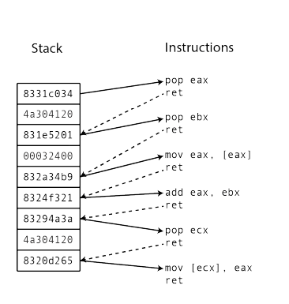

---
documentclass:
    - ctexart
---

# PaX/Grsecurity RAP及其优化

### zet

*zet ([feqin1023@gmail.com](mailto:feqin1023@gmail.com)), HardenedLinux.org, GuangZhou, China*

## 简介

Return-Oriented Programming (ROP)是一种比较高级攻击的方式，能够利用现有代码通过找到的gadgets串来执行攻击者想进行的
任何操作，现有的防御手段只有Control-flow integrity（CFI）是针对这种攻击进行防御的。此外常规针对存储破坏的防御canary, 
NX, ASLR等，对于这种攻击无效。

PaX/Grsecurity RAP是一种CFI的实现方式，本文描述了RAP的实现，以及针对RAP的优化，以及重新实现的hl-cfi的实现。

## 1 导引

Return-Oriented Programming (ROP)[@Krahmer05]是一种比较高级攻击的方式，是code-reuse attack的一种，能够利用现有代码通过找
到的gadgets串来执行攻击者想进行的任何操作，已经有研究者表明gadgets是图灵完备的[@Shacham07]。现有的防御手段只有
Control-flow integrity(CFI)是针对这种攻击进行防御的。此外常规针对存储破坏的防御canary, NX, ASLR等，对于这种攻击无效。

自从CFI[@Abadi05]提出以来，各种实现层出不群，包括gcc upstream里的vtv以及LLVM cfi。不过这些实现有明显的硬伤，vtv防御
virtual table，LLVM cfi只是一个forward cfi实现，没有backward部分。比较而言，PaX/Grsecurity RAP[@PaX18]对于kernel级别的
防护是最理想的选择，不经包括forward而且包括backward实现，backward cfi的实现应该是业界第一个也是为数不多的可以进入生产环境
的。

### 贡献
本文主要是贡献是从编译器角度分析PaX RAP以及HardenedLinux hl-cfi[@Hardenedlinux18]的改进以及实现。

### 内容
本文的内容安排包括：2 背景，3 算法与实现，4 结论以及未来工作。

## 2 背景
Return-Oriented Programming (ROP)[@Krahmer05]是return-into-libc[@Pincus04]的一种一般形式，也就是最终的目标不是进入libc。
ROP的攻击由串接执行一连串的gadgets进行，gadgets是一些几条汇编语言的代码片段，一般来说以 __ret__ 指令结尾，因为ROP gadgets
是图灵完备的[@Shacham07]，理论上来说,ROP可以按照攻击者的目的来做任何计算。

下图简要描述了一个常规的ROP攻击图示，图片来源于[@Carlini14]。左边的Stack是用户stack初始化为gadgets的地址，右边的
Instructions以ret结尾就是gadgets由左边stack处的地址实线指向。这个攻击的结果是将数0x32400加到地址0x4a304120所存储的值。

{图1: ROP图示}

由于这个攻击可以看到ROP发生的根本原因：就是 __call/jmp/ret__ 违反了原始代码控制流。基于这个因素所以有研究者提出了
Control-flow integrity（CFI)[@Abadi05]。原理就是在编译器编译最开始的未经过破坏的源代码的时候就分析控制流，
在 __call/jmp/ret__ 发生的地方插入检测代码，在代码运行的时候来判断报错是否有攻击行为发生。

关于ROP更详细的描述可以参考[@Krahmer05][@Shacham07][@Carlini14]。


## 3 算法与实现

根据公开的文献记载，PaX RAP针对ROP的威胁建模和初始设计[@paxfuture]在2003年时已经存在。下面将描述PaX RAP的算法及其实现，分析这种方式带来的性能损耗，和HardenedLinux社区所做的优化改进。

由上一节背景的描述可知，ROP发生的根源就是因为违反了原始代码的控制流。所以对于相应的检测防御也很简单：在原始控制流转移的
地方由编译器插入检测代码。这其中就会有一个trade-off的考虑:怎么样在保证一定精度的情况下作出防御？

对于控制流的转移可以分为：

1) 直接调用的call/jmp
2) 间接调用的call/jmp - RAP forward cfi
3) 返回               - RAP backward cfi 

对于情况1来说不需要考虑，因为直接调用都是位于 _.text_ 段，只读的section不会发生控制流ROP的攻击。所以ROP的防御就是针对情况2和3。

理论上来说最理想的防御当然是：对于每个会被间接调用的函数在进入该函数的时候作出检测，对于每个 __ret__ 作出检测。对于情况3的
__ret__ 来说可以确定有 __ret__ 就意味着返回，也就是我们必须处理的检测点，也就是backward cfi的实现点，也就是对于所有 __ret__ 
都需要处理。但是对于情况2来说复杂了许多，所有优化以及考虑都在于情况2里面。对于会被间接调用的函数这个问题是一个NP问题，是
一个典型的pointer analysis的问题，也就是求解一个函数指针的指向范围是什么，相对地也就是求一个函数是不是会被间接调用也就是
有没有被函数指针所指向，这个问题在编译器领域大概伴随着优化编译器的最开始研究（大约是1970年）一直进行到现在。

PaX RAP是使用gcc plugin[@gccinternals]来实现的，gcc plugin是gcc提供给第三方程序的一个钩子，可以回调第三方的代码，可以在
gcc内部满足条件的时候输出信息，可以在gcc某个pass之后输出信息也可以调用第三方的代码作为某个pass，只要根据规范提供给gcc想
插入的pass点就行了。其他的详细功能请参考gcc-internals[@gccinternals]或者gcc代码。

### RAP forward cfi

RAP的实现是做为几个gcc pass通过gcc plugin插入gcc来进行的。由上一段的分析知道求解精确的函数是否被间接调用以及函数指针的指
向范围是一个NP问题，所以学术界和工程界有数不清的学术paper以及实现出现，在gcc内部的实现来说有一个flow-insensitive analysis
和一个比较精确的flow-sensitive的算法，insensitive的算法非常简单，就是根据编译器的分析以及函数的声明来判断函数有没有可能
被间接调用，代码如下：比如判断是不是static有没有取过函数的地址。

_flow-insensitive analysis :_

```				
static inline bool
may_be_aliased (const_tree var) {
  return (TREE_CODE (var) != CONST_DECL  
    && !((TREE_STATIC (var) || TREE_PUBLIC (var) || DECL_EXTERNAL (var)) 
    && TREE_READONLY (var)
    && !TYPE_NEEDS_CONSTRUCTING (TREE_TYPE (var)))
    && (TREE_PUBLIC (var) || DECL_EXTERNAL (var) || TREE_ADDRESSABLE (var)));
}
```

flow-sensitive analysis算法无数，gcc的实现基本上是描述于paper[@Hardekopf09]里的算法，在gcc summit也有开发者的
paper[@Berlin05]描述。是基于Constraint set的一类算法，只不过是在gcc中间代码tree-ssa的基础上，针对ssa做了改进，这样基于
ssa的一个稀疏算法。详细的实现参考[@Hardekopf09][@Berlin05]。这是一个流敏感的算法，也就是对于block内部的语句有分析，也会
进入函数的内部。总是是一个比较精确的算法。

介绍完，RAP遇到的难点，接着介绍RAP对间接函数的处理，RAP做了一个更粗略的trade-off，当函数被间接调用的时候当前的调用点，
除了函数指针没有任何信息，这里dereference函数指针会得到函数类型，函数类型和函数指针的指向是静态分析唯一能够知道的信息，
RAP放弃了函数指针的指向，只抽取了函数的类型，对得到的函数类型做hash运算，然后得到一个hash值，这个hash值就是RAP间接检测
的标准。hash值的计算算法是SipHash-2-4[@Aumasson12]，函数类型则是按照标准规范包括返回值和参数[@C11-standard]。接着在间接
调用的地方插入检测代码。RAP的检测代码插入在gcc tree-ssa[@Novillo03][@Novillo04]的表示层,在gcc内部表示来说tree-ssa之前是
tree-ast[@Merrill03],而之后是rtl[@gccinternals]。tree-ssa是几乎整个gcc重要优化pass的实现点。

_PaX RAP forward cfi alogrithms:_

```
for all gimple code of all function
  hashValue = computeHash(currentFunctionType);
  insertHashValueBeforeCurrentFunction(hashValue);
  if (isFunctionPointer(currentPointer))
    functionType = *currentPointer;
    hashValue = computeHash(functionType);
    insertHashValueCheckBeforeCurrentIndirectCall(currentPointer, hashValue);
```

```	
insertHashValueBeforeCurrentFunction(hashValue)
  fprintf(asm_out_file, "\t.quad %#llx", hashValue);

```

```
insertHashValueCheckBeforeCurrentIndirectCall(currentPointer, hashValue);
  value = (long)*((long *)currentPointer - 8);
    if (value == hashValue)
      currentPointer();
    else
      catchAttack();
```

上面给出的是RAP forward cfi实现的算法伪代码，在RAP的实现上有三个问题：

1) 因为RAP没有使用pointer analysis，所以会对全部函数都输出hash值。
2) 上面的伪代码在RAP的实现上是在tree-ssa表示层，所以其实是几条gimple等效的伪代码，但是RAP的实现上这些gimple代码是作为一个整体插入gcc的，而且插入的位置是gcc的所有tree-ssa优化pass之后，也就是gcc根本不会感知到这些代码的存在，也就是说gcc不会去分析这些代码，也不会去优化这些代码。
3) 安全上的考虑，RAP的实现是针对函数类型编码hash，所有函数类型都是同一个hash值，所以这是一个可能的漏洞利用平面。

基于以上的三个问题所以我们给出了Hardenedlinux hl-cfi的实现(hl的意思high level)。

_hl-cfi alogrithms:_

```
for all gimple code of all function
  hashValue = computeHash(currentFunctionType);
  if (isCurrentFunctionMaybeAttacked(currentFunction))
    insertHashValueBeforeCurrentFunction(hashValue);
  if (isFunctionPointer(currentPointer))
    functionType = *currentPointer;
      hashValue = computeHash(functionType);
      insertHashValueCheckBeforeCurrentIndirectCall(currentPointer, hashValue);
```

_解决RAP实现上的问题1_

```
isCurrentFunctionMaybeAttacked(currentFunction)
  lookupPointerAnalysis(currentFunction)
```

_解决RAP实现上的问题2_


```
insertHashValueCheckBeforeCurrentIndirectCall(currentPointer, hashValue)

  +-------
  stmt1;
  call fptr;
  +-------
     
  change to =>
     
  // insertHashValueCheckBeforeCurrentIndirectCall(currentPointer, hashValue)
  +-------
  stmt1;
  lhs_1 = t_;
  ne_expr (lhs_1, s_);  // hsahValueCheck()
  // FALLTHRU
  <bb ???> # true
  cfi_catch();
  <bb ???> # false
  call fptr;
  +--------
```

insertHashValueCheckBeforeCurrentIndirectCall(currentPointer, hashValue)的插入实现为block级别的gimple code，而且hl-cfi
的插入点是在tree-ssa pass的最开始处，在pass_build_ssa_passes之前，所以这里需要实现上的处理，需要模拟gcc已经跑过的所有代
码对于一个假想的检测insertHashValueCheckBeforeCurrentIndirectCall()函数的表示在当前pass点是个什么样子，然后插入对应的代
码。而且对于hl-cfi来说我们需要使用gcc pointer analysis，所以对于isCurrentFunctionMaybeAttacked()的调用又得保证在
pass_ipa_pta(gcc flow-sensitive analysis)之后。cfi的检测代码的优化是一个复杂的问题，因为这是一个运行时才能知道的函数指针
值，常规静态分析优化[@Gupta93]基本上没有用。所以hl-cfi的实现相对来说考虑的只能是尽可能利用gcc现有的优化，检测代码的hash
常数可以被gcc做register promotion[@Makarov07]，以及分析信息传播到整个fucntion里面[@Novillo05]进一步给其他pass提供机会。
在hl-cfi构建block以及edge的时候给gcc提供profile信息[@Hubicka05][@Ramasamy08]，使用profile的相关基础代码。给后续的优化
pass比如code placement以及cache优化的pass提供信息。

_解决RAP实现问题3_

```
// 这部分代码因为复杂度的原因，并没有在hl-cfi里面实现，下面只是提供算法。
 
for all gimple code of all function
  if (isCurrentFunctionMaybeAttacked(currentFunction))
    insertHashValueBeforeCurrentFunction(hashValue);
  if (isFunctionPointer(currentPointer))
    if (pointerAliasSetChanged(currentPointer, currentCodePlace))
      functionType = *currentPointer;
        // 根据当前的代码分析结果来给一个变化的seed来得到一个
        // 跟当前函数指针和函数类型相关的hash值。
        hashValue = computeHash(functionType, seed);
        insertCurrentHashValue(currentPointer, functionType, currentCodePlace);
    else
        hashValue = lookupHashValue(currentPointer, fucntionType, currentCodePlace);
        insertHashValueCheckBeforeCurrentIndirectCall(currentPointer, hashValue);
```

为了解决问题3，计算一个动态的hash值，根据函数指针的变化而变化。

### RAP backward cfi

为了解决 __ret__ 的问题，PaX Team提出了backward cfi的软件实现方案。

```
for all rtl code of all function
  if (isCurrentRTLIsRet(currentRTL))
    // 调用gcc内置函数，得到返回地址。
    retAddress = __builtin_return_address();
    // 在gcc里，这个函数类型通过分析可以知道的。
    hashValue = getHash(functionType);
    insertRetCheck(retAddress，hashValue);
```

对于这个检测函数的描述跟RAP实现略有差异，RAP比较的是一个hashValue的取反的值。

```
insertRetCheck(retAddress, hashValue)
  if (long*((long *)retAddress - 8) != hashValue)
    catchAttack();
```

对于backward cfi来说这大概是业界仅有的几个的实现，而且跟RAP forward cfi的一样，也是一串没有经过编译器优化的代码直接出现
在输出的object里，不过想不到优化的方案，只能期待硬件更新支持backward cfi，比如类似ARMv8.3的PA[@zet17]， ARMv8.5的MTE[@armmte]以及未来的Intel CET[@intelcet]等。

## 4 结论

对于hl-cfi的实现和RAP的实现在spec CPU2017上做了一个对比测试，因为RAP本身是为了linux kernel防御，在优化RAP以及开发hl-cfi
的时候，为了方便测试以及开发，我们抽取出了RAP作为一个独立的项目，hl-cfi也是如此，正因为这是两个针对kernel的项目，因为应
用代码外部library依赖的问题，CPU2017的很多测试跑不过，跑过的数据如下：

RAP | hl-cfi | hl-cfi - RAP / RAP
--- | --- | ---
2.15| 2.35| 9.3%

大约有9.3%的性能提升。

由于hl-cfi的实现依赖于pointer analysis，如果使用lto[@Glek10]来编译linux kernel，相信hl-cfi应该会有一个更佳的表现。lto模
式更好的一个特点是只需要修改linux kernel的编译构建脚本，对于hl-cfi本身不需要做改变。期待未来lto的编译能够普及。

## 引用
